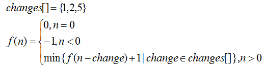

# 前言

算法，对于初级程序员(**Api Caller**) 而言,可能并不怎么重要，因为平时工作中压根用不到算法。但是要进入高级工程师，就要知道，如何用最优的计算方式来完成同一件任务。比如，腾讯面试经常问到的，给你**一个亿的用户数据，要你从中找到指定的用户信息，如何达到最快**，又或者，**手机QQ本地聊天记录中有1W条数据，如何最快找到包含搜索关键字的聊天记录**，这些都是直接影响到用户体验的功能，又比如，**滴滴打车app，如何进行最优的派单方案，让 所有的注册车辆都有订单**等等.诸如此类的问题，**Api Caller** 的程序员何以解决，拿不到高薪，是有自身的原因的，谁让你对高级算法一无所知。

算法，基于数学，应用于生活中的各种实际问题，它是一个巨大的知识体系，深不可测，仅以一文概论，不现实。本文详解的是，**动态规划算法**，一种解决问题的**通用套路**，学会了套路，相当于入了门，遇到任何问题都可以尝试套用框架,唯一不足的就是**深度和广度的不足，多训练就会有提升**，遇到再难的问题也不至于抓耳挠腮，不知所措。

上一篇 [斐波拉契数列](投稿请把这里换成上一篇文章的链接)的问题，讲述了动态规划算法的大概套路，这次来一点真正的实战，编程语言依然用**kotlin**.

# 前文回顾

上一篇文末说的动态规划基本套路，最重要的，也是**第一个**步骤 是 写出动态规划**"状态转移方程"**

这一步骤是和编程语言完全无关的。纯粹的数学理论。

# 动态规划实战：凑零钱问题

## 问题抛出

一件商品要18块，但是我只有零钱，1元，2元，5元，假设零钱数目无限多。现在我要知道，我要用零钱买这一件商品，所需的零钱的**最少**张数是多少。

## 问题分离

### 前提

零钱有**1元，2元，5元**, 并且数量无限多。

### 目标

求解凑出**18**元的目标金额所需零钱的最少张数

### 问题分解

分情况讨论，

- 如果目标金额是**0**，那么不需要任何零钱来凑，所以零钱张数是**0**

- 如果目标金额是负数，这属于异常情况，我零钱张数返回**-1**，表示异常情况。

- 如果目标金额是正数，那么要尝试用零钱去凑，**穷举**列出所有可以达成这个目标的零钱组合，然后取**最小值**。

  具体做法为：遍历所有零钱，计算出目标金额与当前零钱面值的差，把差进入下一轮循环。本轮循环取**1+递归回调值**的最小值。

看着有点绕，写成**“状态转移方程”**一眼就能看明白.



根据上面的**“状态转移方程”**，写出**伪代码**：

```kotlin
  val coins = [1,2,5]// 零钱只提供1,2,5元的，不限数目
  res = Long.maxvalue.// 由于是要取最小值，所以初始化为long的最大值
  f(n) = if(n=0) return 0 (目标金额是0，那就不需要凑，返回0)
         if(n<0) return -1(目标金额是负数，异常情况，返回-1)
         if(n>0) {
            for(i in coins){// 遍历所有零钱 
               res = min(res,1+ f(n-coin)) // 用一张当前零钱面值，加上扣除当前面值之后的金额递归回调
            }
            return res
      }
```

先不写程序代码，我们来分析一下这种原始解法的复杂度。 

这里我们先把零钱数组的size设定为**k**

**时间复杂度:**

- 子问题的个数是

  这里不止涉及到了递归，还涉及到了遍历size为**k**数组的， 就这个问题而言,按照最坏的情况来算，假设每一个子问题都会分裂**k份**，那么所有子问题的个数就是**k<sup>n</sup>**

- 解决一个子问题所需的时间

  size为**k**的循环中，存在**一次加法**，和**一次min对比**计算，所以满打满算有**2*k=2k**次运算.

所以，时间复杂度就是**k<sup>n</sup>**x**2k** = **O(2*k<sup>n+1</sup>)**

一个**指数级别的时间复杂度**，一看就有点慎得慌。

**空间复杂度：**

由于没有数据保存，一律认为空间复杂度是**O(1)**

## 暴力解法

OK，思路清楚了，我们开始码代码

```kotlin
import java.lang.Integer.min

val change = arrayOf(1, 2, 5) // 零钱就是1,2,5

var calCount = 0

/**
 * @param targetAmount 要用零钱凑成的目标金额
 */
fun changeMoney(targetAmount: Long): Int {
    var finalCount = Int.MAX_VALUE // 由于要计算出最小值，所以先初始化为最大值
    if (targetAmount == 0L) return 0 // 贼
    if (targetAmount < 0) return -1
    for (c in change) {
        val subRes = changeMoney(targetAmount - c)
        if (subRes == -1) continue
        finalCount = min(finalCount, 1 + subRes)
    }
    calCount++
    return finalCount
}

fun main() {
    val start = System.currentTimeMillis()
    val changeMoney = changeMoney(18)
    println("凑成目标金额所需的最小零钱数：$changeMoney , 子问题总数是${calCount}")
    println("耗时：${System.currentTimeMillis() - start}ms")
}
```

执行结果：

```java
凑成目标金额所需的最小零钱数：5 , 子问题总数是12956
耗时：4ms
```

心算一下，18块钱，拆分成(1,2,5)零钱，应该是需要**3x5+2x1+1x1** , 所以零钱的张数是  3+1+1 = 5. 可以看到，仅仅是很小的金额的计算，这种穷举的暴力解法，居然要将近**1万3千次运算**。可想而知其中有多少是无用功。

## 一重改进

既然是无用功，那么使用map保存已经计算出的结果，再次求值时，不必重新计算，而是直接取值。

```kotlin
import java.lang.Integer.min

val change = arrayOf(1, 2, 5) // 零钱就是1,2,5

var calCount = 0

/**
 * 优化方案1:用一个容器把已经计算出来的结果保存起来,计算之前先看容器中有没有,有就直接取，没有就去计算，计算之后存入容器
 * @param targetAmount 要用零钱凑成的目标金额
 * 进行if return/continue 优化
 */
fun changeMoney2(map: HashMap<Long, Int>?, targetAmount: Long): Int {
    val mapThis = map ?: HashMap()// 如果是空，就创建

    var finalCount = Int.MAX_VALUE // 由于要计算出最小值，所以先初始化为最大值
    if (targetAmount == 0L) return 0
    if (targetAmount < 0) return -1
    for (c in change) {
        //要不要执行？先看容器里面有没有
        var cache = mapThis[targetAmount - c]
        if (cache == null) {// 如果找不到，就说明容器中没有
            cache = changeMoney2(mapThis, targetAmount - c)// 那就计算
            if (cache == -1) continue // -1异常情况就不要参与保存了
            mapThis[targetAmount - c] = cache // 保存
        }
        finalCount = min(finalCount, 1 + cache)// 最终结果记得+1,同時取最小值
        calCount++
    }

    println("计算过程：$finalCount  $mapThis")
    return finalCount
}

fun main() {
    val start = System.currentTimeMillis()
    val changeMoney = changeMoney2(null, 18)
    println("凑成目标金额所需的最小零钱数：$changeMoney , 子问题的总运算次数是：${calCount}")
    println("耗时：${System.currentTimeMillis() - start}ms")
}
```

执行结果：

```java
计算过程：5  {0=0, 1=1, 2=1, 3=2, 4=2, 5=1, 6=2, 7=2, 8=3, 9=3, 10=2, 11=3, 12=3, 13=4, 14=4, 15=3, 16=4, 17=4}
凑成目标金额所需的最小零钱数：5 , 子问题的总运算次数是：49
耗时：5ms
```

子问题的运算次数，从之前的上万次，直接降低为18次。

但是运行耗时几乎没有变化。**这是由于目标数值太少，仅仅是18，还不足以看出算法耗时的差别。换成158,1588试试看**

零钱依然假定为**k**种

**时间复杂度**：

- 子问题的个数：

  目标金额不会超过总金额数(加入目标金额是n=100，最多也就循环100次)，所以取最大值 **n**

- 子问题解决消耗时间: 

  每一个子问题只需要一次加法，和一次min计算，但是必须循环 k 次，所以每个子问题耗时 **2k**

时间复杂度降低为**O(2kn)**, 直接从之前的k的指数级别，降低为k的1次方。运算次数骤减。

**空间复杂度**：

- 子问题的个数：

  n

- 子问题解决消耗空间: 

  每一个子问题都会在map中保存一个值，所以每个子问题消耗空间1

即使子问题的个数是**n**，但是由于共享hashmap的原因，空间复杂度是 **O(n)**


## 二重改进

把从上而下的逆向递归，改成更容易理解的从下而上的遍历。先计算出f(1),f(2)...最后计算到最终值f(18).

```kotlin
import java.lang.Integer.min

val change = arrayOf(1, 2, 5) // 零钱就是1,2,5

var calCount = 0

fun changeMoney3(lastTarget: Int): Int {
    // 所以做法就是，从0开始往后推演，从树根往树顶推算
    val hashMap = HashMap<Int, Int>()
    var result = -1
    for (currentTarget in 1..lastTarget) {
        result = getMin(currentTarget, hashMap)
    }
    println("最终保存的map内容是：$hashMap ")
    return result
}

fun getMin(currentTarget: Int, map: HashMap<Int, Int>): Int {
    if (map.containsKey(currentTarget)) {
        println("找到已经存在的记录: map[${currentTarget}]=${map[currentTarget]!!}")
        return map[currentTarget]!!
    }
    var res = Int.MAX_VALUE
    loop@ for (c in change) {
        val currentRes = when {
            currentTarget - c == 0 -> {
                map[currentTarget] = 1
                1
            }
            currentTarget - c > 0 -> {
                val x = 1 + getMin(
                    currentTarget - c,
                    map
                )/* 1表示当前金额,getMin(currentTarget - c, map) 表示去掉当前金额之后，所需零钱数 */
                calCount++
                map[currentTarget] = x // 保存起来
                x
            }
            else -> {
                continue@loop
            }
        }
        res = min(res, currentRes)
    }

    return res
}

//测试代码
fun main() {
    val start = System.currentTimeMillis()
    val changeMoney3 = changeMoney3(18)
    println("凑成目标金额所需的最小零钱数：$changeMoney3 子问题运算次数为：${calCount}")
    println("耗时：${System.currentTimeMillis() - start}ms")
}
```

运行结果：

```kotlin
最终保存的map内容是：{1=1, 2=1, 3=2, 4=2, 5=1, 6=2, 7=2, 8=3, 9=3, 10=2, 11=3, 12=3, 13=4, 14=4, 15=3, 16=4, 17=4, 18=5} 
凑成目标金额所需的最小零钱数：5 子问题运算次数为：46
耗时：5ms
```

零钱数依然设定为**K**

**时间复杂度**：

- 子问题的个数：

  目标金额是n，最多进行n次遍历，所以子问题的个数是 n

- 子问题解决消耗时间: 

  一个子问题，依然是一次加法和一次min运算，再算上外层k消耗时间为2

时间复杂度降低为**O(2kn)**

空间复杂度：

- 子问题的个数：

  **n**

- 子问题解决消耗空间: 

  每一个子问题都会在map中保存一个值，所以每个子问题消耗空间1

即使子问题的个数是n，但是由于共享hashmap的原因，空间复杂度是 O(n)

复杂度和上面一种解法一样！但是思维上，比上一种更容易理解，更人性化。


## 三重改进

之前我是用map来保存前一步计算出的值，尝试一下能否不用map，而只是用循环内的临时变量来存。

但是发现不行，因为 这个问题不能类比 **斐波拉契数列**, 运算结果的依赖性比**斐波拉契数列**更加复杂。所以作罢。


# 结语

以凑零钱问题为例，展示 动态规划算法的实战应用价值。相信本文已经解析的很清楚了。就是这么一个套路。其他 最值问题也差不多按照这个套路，做出最优解也只是时间问题。

但是，现实中，我们不会只想知道零钱最少需要多少张，我还想知道零钱怎么组合最优,怎么解?并且 零钱可能**无限多**么？如果**零钱数目有限**，那上面的解法又该**如何修改**？ 篇幅太长不利于阅读，我把解答放到下一章。

尽请期待！