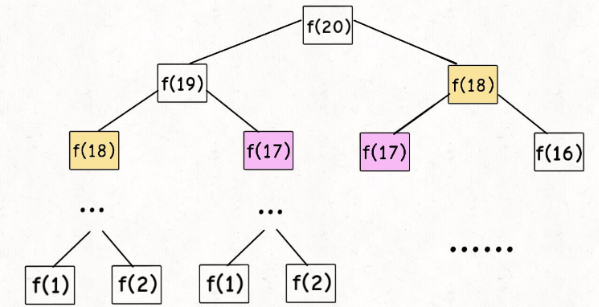

# 所谓动态规划算法


# 所谓时间复杂度

时间复杂度 = **子问题的个数** x **解决一个子问题所需的时间**

描述算法效率的名词。次数越高，复杂度越大, 解决同样的问题花费的时间就越长。

# 所谓空间复杂度

空间复杂度 = **子问题的个数** x **解决一个子问题所需的内存空间**

时间复杂度越高，说明算法占用的内存空间越大。

# 举个例子:斐波拉契数列

著名的斐波拉契数列数学公式：


如果我们要得到一个 f(20)，斐波拉契数列上位置20的函数值。可以完全按照数学公式来写代码。

## 暴力解法

利用递归算法来编程就是如下写法：

```kotlin
fun fib1(x: Int): Long {
    return if (x == 1 || x == 2) {
        1
    } else
        fib1(x - 1) + fib1(x - 2)
}
```

如果用上面的算法来计算斐波拉契数列中某个节点的值，我们来算算时间复杂度是多少。

如果是f(20),那么递归树结构就是：



- 一个问题，都会分裂成2个子问题。所以子问题的个数是2的n次方。

- 解决一个子问题，只需要一次加法，并没有涉及到循环。所以，解决一个子问题的时间是1

合并起来，时间复杂度就是O(2^n) 指数级别的复杂度，效率极低。

从上面的图可以看出，很多子问题都是重复计算的。比如f(18),f(17)...这就是上面的算法所带来的低效率问题，在做很多不必要的重复性工作。

空间复杂度（O(1)）这里不谈，因为都是临时变量，不存在永久保存的数据。

## 一重改进

既然上面的f(17),f(18)等都在重复计算，那么我们用一个备忘录，记录已经计算出的结果。

比如把上面的f(18)的值用map记录下来，下次需要计算的时候，直接取值,而不是再去计算

程序变成这样：

```kotlin
fun fib2(x: Int): Long {
    if (x < 1) return 0
    val map = HashMap<Int, Long>()
    return helper(map, x)
}

fun helper(map: HashMap<Int, Long>, x: Int): Long {
    if (x == 1 || x == 2) return 1
    if (map[x] != null && map[x] != 0L) //如果已经计算过了，那就是说保存过了，就直接返回
        return map[x]!!
    // 否则，就计算之后再保存
    map[x] = helper(map, x - 1) + helper(map, x - 2) // 这里依然是递归
    return map[x]!!
}
```

这种解法的时间复杂度该如何计算？

上面的做法，显然就是f(18)等这种重复性计算不再存在，所以可以理解为：当需要f(18)的时候，会优先从 map中去取。所以，计算出f(20)，也就最多有20个子问题。所以

- f(n)子问题的个数是 n,

- 解决子问题的时间也还是1，

  所以时间复杂度是 O(n) , 对比 前面一种解法的O(2^n)简直就是降维打击。

而**空间复杂度**：

由于这里使用了 map集合来保存已经计算出来的值，所以，空间复杂度：

- f(n)子问题的个数还是n
- 每一个子问题都会占用1个空间

所以空间复杂度= O(n)

## 二重改进

上面的做法依然是和第一种写法一样的从上往下的递归，要求 f(20)首先要知道f(19) f(18),而知道f(19)又必须先知道f(18)和f(17)...那么我们能不能倒过来? f(1)和f(2)都是1，f(3)=f(1)+f(2),f(4)=f(2)+f(3)...如果从下往上推算，

程序写成下面这样:

```kotlin
fun fib3(x: Int): Long {

    val map = HashMap<Int, Long>() // 初始化一个map

    map[1] = 1
    map[2] = 1

    for (i in 3..x) {
        val pre1 = map[i - 1] ?: 0
        val pre2 = map[i - 2] ?: 0
        map[i] = pre1 + pre2
    }
    return map[x] ?: 0

}
```

时间复杂度：

- 子问题的个数依然是N
- 处理一个子问题的，没有循环，时间依然是1

所以时间复杂度依然是：O(n)

空间复杂度:

- 子问题的个数是N
- 处理一个子问题，需要保存一个数据，所以占空间是1

空间复杂度为：O(n)

## 三重改进

上面一种改进方法，我们用map保存了已经计算出来的值，自上而下计算，和自下而上计算，时间和空间复杂度都相同。但是，自下而上的计算依然有优化空间。

思考:是否可以不需要map来保存数据？

上一节的改进，f(n)依赖的仅仅是f(n-1)和f(n-2). 而不需要另外的数据一直保存。

```kotlin
/**
 * 最后优化
 */
fun fib4(x: Int): Long {
    if (x == 1 || x == 2) return 1L
    var cur = 1L
    var pre = 1L
    for (i in 3..x) {
        val sum = cur + pre
        pre = cur
        cur = sum
    }
    return cur
}
```

时间复杂度：

- 子问题的个数是n
- 解决一个子问题所需的时间是1

所以时间复杂度是O(n)

空间复杂度：

- 子问题的个数是n
- 一个子问题所占用的空间是1，但是 都是临时占用，函数执行完毕之后就会释放，算法中的临时变量所占空间并不会累加，

所以空间复杂度，是O(1)

## 测试结果

先摆出所有的测试代码（kotlin）

```kotlin
package com.zhou.myapplication

import android.annotation.SuppressLint
import java.text.SimpleDateFormat
import java.util.*
import kotlin.collections.HashMap


/**
 * 扩展Long的一个方法，将本身转化成日期时间格式的字符串
 */
@SuppressLint("SimpleDateFormat")
fun Long.transTimeStamp(): String {
    return SimpleDateFormat("yyyy-MM-dd HH:mm:ss").format(Date(this))
}

fun Long.isCurrentDay(arg: Long): Boolean {

    val yyyyMMdd = SimpleDateFormat("yyyy-MM-dd")
    val formatThis = yyyyMMdd.format(Date(this))
    val formatArg = yyyyMMdd.format(Date(arg))
    return formatThis == formatArg
}

/**
 * 试试斐波拉契数列
 */
fun main() {
    var startTime = 0L
    val x = 900
//    println("===========粗暴的递归解法：=========")
//    var startTime = System.currentTimeMillis()
//    println("计算开始，启动时间是：${startTime.transTimeStamp()}")
//    println("计算结果是：${fib1(50)}")
//    println("计算完成，现在是${System.currentTimeMillis().transTimeStamp()}，一共耗时${(System.currentTimeMillis() - startTime) / 1000.0}秒")

    println("===========改良后的粗暴的递归解法：=========")
    startTime = System.currentTimeMillis()
    println("计算开始，启动时间是：${startTime.transTimeStamp()}")
    println("计算结果是：${fib2(x)}")
    println("计算完成，现在是${System.currentTimeMillis().transTimeStamp()}，一共耗时${(System.currentTimeMillis() - startTime) / 1000.0}秒")

    println("===========采用自下而上的计算方法：=========")
    startTime = System.currentTimeMillis()
    println("计算开始，启动时间是：${startTime.transTimeStamp()}")
    println("计算结果是：${fib3(x)}")
    println("计算完成，现在是${System.currentTimeMillis().transTimeStamp()}，一共耗时${(System.currentTimeMillis() - startTime) / 1000.0}秒")

    println("===========采用自下而上的计算方法(空间优化版)：=========")
    startTime = System.currentTimeMillis()
    println("计算开始，启动时间是：${startTime.transTimeStamp()}")
    println("计算结果是：${fib4(x)}")
    println("计算完成，现在是${System.currentTimeMillis().transTimeStamp()}，一共耗时${(System.currentTimeMillis() - startTime) / 1000.0}秒")

}

/**
 * 自上而下的递归算法, 也是最暴力的解法
 *
 * f(n) = if(n=1||n==2)1
 *  else {
 *      f(n-1)+f(n-2)
 *  }
 *
 *  时间复杂度O(2^n)
 */
fun fib1(x: Int): Long {
    return if (x == 1 || x == 2) {
        1
    } else
        fib1(x - 1) + fib1(x - 2)
}

/**
 * 由于存在大量重复计算，现在使用备忘录map，记录下已经计算出的数值
 */
fun fib2(x: Int): Long {
    if (x < 1) return 0
    val map = HashMap<Int, Long>()
    return helper(map, x)
}

fun helper(map: HashMap<Int, Long>, x: Int): Long {
    if (x == 1 || x == 2) return 1
    if (map[x] != null && map[x] != 0L) //如果已经计算过了，那就是说保存过了，就直接返回
        return map[x]!!
    // 否则，就计算之后再保存
    map[x] = helper(map, x - 1) + helper(map, x - 2) // 这里依然是递归
    return map[x]!!
}

/**
 * 趁他还在计算，我们来写第三种解法，上面用一个map来记录了已经计算出的值，避免重复计算，可以节省不少时间，但是依然可以优化。
 *
 * 上面的解法都是涉及到递归，递归就是自上而下的计算，然后由下往上回传。
 *
 * 那么可不可以自下而上直接计算呢？
 */
fun fib3(x: Int): Long {

    val map = HashMap<Int, Long>() // 初始化一个map

    map[1] = 1
    map[2] = 1

    for (i in 3..x) {
        val pre1 = map[i - 1] ?: 0
        val pre2 = map[i - 2] ?: 0
        map[i] = pre1 + pre2
    }
    return map[x] ?: 0

}

/**
 * 最后优化算法,去除map，使用临时变量来解决
 */
fun fib4(x: Int): Long {
    if (x == 1 || x == 2) return 1L
    var cur = 1L
    var pre = 1L
    for (i in 3..x) {
        val sum = cur + pre
        pre = cur
        cur = sum
    }
    return cur
}
```

结果：

```java
===========改良后的粗暴的递归解法：=========
计算开始，启动时间是：2020-04-22 16:31:25
计算结果是：5855021214961818160
计算完成，现在是2020-04-22 16:31:26，一共耗时0.026秒
===========采用自下而上的计算方法：=========
计算开始，启动时间是：2020-04-22 16:31:26
计算结果是：5855021214961818160
计算完成，现在是2020-04-22 16:31:26，一共耗时0.0秒
===========采用自下而上的计算方法(空间优化版)：=========
计算开始，启动时间是：2020-04-22 16:31:26
计算结果是：5855021214961818160
计算完成，现在是2020-04-22 16:31:26，一共耗时0.0秒
```

上述4种解法：第一种暴力递归法，由于我这里参数N是900，之前我单独测的时候，N为50，耗时就已经超过了30秒，可见暴力解法的效率有多低。

可以看到，在N=900的情况下，后3种解法（自上而下hashMap解法，自下而上的hashMap存数据解法， 不用hashmap的自下而上解法），效率都很高，递归的效率稍低。后面两种，几乎是秒解。

# 再举个例子：凑零钱

举个例子：

> 一件商品要158块，但是我没有百元大钞，只有零钱，1元，2元，5元，假设零钱数目无限多。
>
> 现在我要知道，我要用零钱买这一件商品，所需的零钱的**最少**张数是多少。

同样，思考一下，

> 零钱只有1元，2元，5元。如果目标金额是0，或者负数，都属于异常，直接返回0 ，-1.
>
> 如果目标金额是正数，

然后写出伪代码：

```kotlin
  val coins = [1,2,5]
  res = Long.maxvalue.
  f(n) = if(n=0) return 0 (目标金额是0，那就不需要凑，返回0)
         if(n<0) return -1(目标金额是负数，异常情况，返回-1)
         if(n>0) {
            for(i in coins){// 遍历所有零钱 
               res = min(res,1+ f(n-coin)) // 用一张当前零钱面值，加上扣除当前面值之后的金额递归回调
            }
            return res
      }
```

时间复杂度：

- 子问题的个数是 (假设零钱分为n类，数量不限) 分裂次数不确，假设次数是，那么子问题的总数就是 n^k，总之这是一个指数级别的数字
- 解决一个子问题所需的时间，一个要分裂成n个子问题，由于有循环递归，所以解决一个子问题实际上需要的时间是n

所以，时间复杂度就是`O(n*n^k)`

空间复杂度：

由于没有数据保存，一律认为空间复杂度是O(1)

## 暴力解法

改成kotlin写法就是：

```kotlin
val change = arrayOf(1, 2, 5) // 零钱就是1,2,5

/**
 * @param targetAmount 要用零钱凑成的目标金额
 */
fun changeMoney(targetAmount: Long): Int {
    var finalCount = Int.MAX_VALUE // 由于要计算出最小值，所以先初始化为最大值
    if (targetAmount == 0L) return 0 // 贼
    if (targetAmount < 0) return -1
    for (c in change) {
        val subRes = changeMoney(targetAmount - c)
        if (subRes == -1) continue
        finalCount = min(finalCount, 1 + subRes)
    }
    println("计算过程：$finalCount")
    return finalCount
}

fun main() {
    val changeMoney = changeMoney(11)
    println("凑成目标金额所需的最小零钱数：$changeMoney")
}
```

11块钱，拆分成零钱，最小数目是3个，2个5，一个1.符合预期。但是从执行日志上来看，很简单的运算，执行了很多次。毕竟递归算法有很多重复算法.

## 一重改进

参考上一个例子的改进方法，依然先使用自上而下的递归，加上 去重手段，保存已经计算出的值。

```kotlin
/**
 * 优化方案1:用一个容器把已经计算出来的结果保存起来,计算之前先看容器中有没有,有就直接取，没有就去计算，计算之后存入容器
 * @param targetAmount 要用零钱凑成的目标金额
 * 进行if return/continue 优化
 */
fun changeMoney2(map: HashMap<Long, Int>?, targetAmount: Long): Int {
    val mapThis = map ?: HashMap()// 如果是空，就创建

    var finalCount = Int.MAX_VALUE // 由于要计算出最小值，所以先初始化为最大值
    if (targetAmount == 0L) return 0
    if (targetAmount < 0) return -1
    for (c in change) {
        //要不要执行？先看容器里面有没有
        var cache = mapThis[targetAmount - c]
        if (cache == null) {// 如果找不到，就说明容器中没有
            cache = changeMoney2(mapThis, targetAmount - c)// 那就计算
            if (cache == -1) continue // -1异常情况就不要参与保存了
            mapThis[targetAmount - c] = cache // 保存
        }
        finalCount = min(finalCount, 1 + cache)// 最终结果记得+1,同時取最小值
    }
    println("计算过程：$finalCount  $mapThis")
    return finalCount
}

fun main() {
    val changeMoney = changeMoney2(null, 18)
    println("凑成目标金额所需的最小零钱数：$changeMoney")
}
```

时间复杂度：由于去除了重复的计算，时间复杂度降低为O(n)

- 子问题的个数：目标金额不会超过总金额数(因为金额数是n=100，最多也就循环100次)，所以取最大值 n
- 子问题解决消耗时间: 没有循环，1

时间复杂度降低为O(n)

空间复杂度：

- 子问题的个数：目标金额不会超过总金额数(因为金额数是n=100，最多也就循环100次)，所以取最大值 n
- 子问题解决消耗空间: 每一个子问题都会在map中保存一个值，所以每个子问题消耗空间1

即使子问题的个数是n，但是由于共享hashmap的原因，空间复杂度是 O(n)


## 二重改进

```kotlin
fun changeMoney3(lastTarget: Int): Int {
    // 所以做法就是，从0开始往后推演，从树根往树顶推算
    val hashMap = HashMap<Int, Int>()
    var result = -1
    for (currentTarget in 0..lastTarget) {
        result = getMin(currentTarget, hashMap)
    }
    println("最终保存的map内容是：$hashMap ")
    return result
}

fun getMin(currentTarget: Int, map: HashMap<Int, Int>): Int {
    if (map.containsKey(currentTarget)) return map[currentTarget] ?: -1
    change.sortDescending()// 从大到小遍历
    loop@ for (c in change) {
        return when {
            currentTarget - c == 0 -> {
                map[currentTarget] = 1
                1
            }
            currentTarget - c > 0 -> {
                val x = 1 + getMin(currentTarget - c, map)
                map[currentTarget] = x // 保存起来
                x
            }
            else -> {
                continue@loop
            }
        }
    }
    return -1
}

//测试代码
fun main() {
    val changeMoney3 = changeMoney3(20)
    println("凑成目标金额所需的最小零钱数：$changeMoney3")
}
```

时间复杂度：

- 子问题的个数：目标金额是20，最多进行20次遍历，所以子问题的个数是 n
- 子问题解决消耗时间: 存在递归，但是由于hashmap存储的原因，解决一个子问题，都会优先从hashmap中去取值，然后+1，所以即使有递归，消耗的时间也依然是1

时间复杂度降低为O(n)

空间复杂度：

- 子问题的个数：目标金额是20，最多进行20次遍历，所以子问题的个数是 n
- 子问题解决消耗空间: 每一个子问题都会在map中保存一个值，所以每个子问题消耗空间1

即使子问题的个数是n，但是由于共享hashmap的原因，空间复杂度是 O(n)

复杂度和上面一种解法一样！但是思维上，比上一种更容易理解，更人性化。


## 拓展思维

上面凑零钱算法只是告诉我们如何得出最小的零钱数目，但是并没有告诉我们零钱是如何组成的。

那么下一个目标，我不仅仅想知道零钱需要多少个，我还要知道零钱的组合方式。

比如：11块钱总额，打散成最少数目的零钱，需要两张5块的，加上一张一块的，一共3张零钱。

```kotlin

val change = arrayOf(1, 2, 5) // 零钱就是1,2,5, 零钱必须是有序的

fun changeMoney(lastTarget: Int): List<Int>? {
    // 所以做法就是，从1开始往后推演，从树根往树顶推算
    val hashMap = HashMap<Int, List<Int>>()
    for (currentTarget in 1..lastTarget) {
        getMin(currentTarget, hashMap)
    }
    return hashMap[lastTarget]
}

fun getMin(currentTarget: Int, map: HashMap<Int, List<Int>>): List<Int> {
    if (map.containsKey(currentTarget) && map[currentTarget]?.isNotEmpty()!!) {
        return map[currentTarget] ?: arrayListOf()
    }
    change.sortDescending()// 我需要从大到小来遍历，所以必须先排序
    loop@ for (c in change) {
        return when {
            currentTarget - c == 0 -> {
                val list = arrayListOf(c)
                map[currentTarget] = list // 目标金额等于当前零钱，返回 1，只需要1张零钱就行
                list
            }
            currentTarget - c > 0 -> {
                val min = getMin(currentTarget - c, map)// 目标金额大于当前零钱，说明需要当前零钱一张之后，剩下的钱要进入下一轮循环

                // 建立一个可变数组，先保存下一轮循环的结果，然后创建不可变数组赋值给总map
                val temp = mutableListOf<Int>()
                temp.addAll(min)
                temp.add(c)

                map[currentTarget] = temp// 保存起来
                min
            }
            else -> {
                continue@loop
            }
        }
    }
    return arrayListOf()
}

fun main() {
    val targetAmount = 129
    println("目标金额是 ：$targetAmount")
    val changeMoney3 = changeMoney(targetAmount)
    println("凑成目标金额所需的最小零钱：${changeMoney3?.size} 张")

    // 太难看了，相同的金额应该要累计起来，最后的展现形式应该是 5*21 , 2*2
    val beautifulMap = HashMap<Int, Int>()
    for (c in changeMoney3!!) {// c是当前金额
        if (beautifulMap.keys.contains(c)) {
            beautifulMap[c] = beautifulMap[c]!!.plus(1)
        } else {
            beautifulMap[c] = 1
        }
    }

    println("================需要=================")
    // 遍历map
    for (i in beautifulMap) {
        println("${i.key}元零钱: ${i.value}张")
    }
}
```

运行结果：

```java
目标金额是 ：129
凑成目标金额所需的最小零钱：27 张
================需要=================
2元零钱: 2张
5元零钱: 25张
```

时间复杂度：

- 子问题的个数

  由于有map在记录当前值，所以如果目标金额是129，也最多就需要计算129次，个数：n

- 一个子问题所花费的时间

  一个子问题最多进行一次减法运算（当前金额减去当前零钱），以及一次 加法运算（结果list的合并），时间：2

所以时间复杂度 ： O(2n)

空间复杂度：

- 子问题的个数

  n

- 一个子问题所花费的空间

  每一个子问题最多需要临时创建一个list来保存当前结果，所以空间 1

空间复杂度 ： O(n)


## 再拓展

其实还可以再扩展，上面的凑零钱，都是在零钱无限多的情况下。但是，现实中零钱不可能无限多，加入1元的也就20张.2元的也就只有30张。5元的只有8张。我要凑出116元总金额，仍然需要计算出最少的零钱张数，又该如何计算？这里还存在一个是否能够凑出的问题。

这个就需要思考了。先干活。


## 反思

凑零钱问题，必须要动态规划法吗？其实也不一定，其实还有更简单的算法 ！没错，**整数取余**法，说人话:

> 给你107的目标金额，零钱有1元，2元，5元，10元，数目不限。要追求最少的零钱数目。
>
> 那我肯定先用最大额的零钱来凑整，凑到它不能满足余下金额之后，再用较小钞票来做循环。直到最小金额。

换成代码：

```kotlin
// 其实解决此类问题还有一个整除取余法
val changes = arrayOf(1, 2, 5, 10) // 零钱就是1,2,5, 零钱必须是有序的
fun changeMoney2(target: Int): Map<Int, Int> {
    changes.sortDescending()// 从大到小排
    var temp = target
    val map = HashMap<Int, Int>()
    for (c in changes) {
        val v1 = temp / c // 整除的值, 表示当前钞票的张数
        map[c] = v1
        temp %= c // 取余的值，表示当前钞票过大之后造成的余数
    }
    return map
}

fun readMap(map: Map<Int, Int>) {
    println("================需要=================")
    // 遍历map
    for (i in map) {
        println("${i.key}元零钱: ${i.value}张")
    }
}

fun main() {
    val changeMoney2 = changeMoney2(107)
    readMap(changeMoney2)
}
```

运行结果：

```java
=========凑出107元总金额=======
========需要=================
1元零钱: 0张
2元零钱: 1张
5元零钱: 1张
10元零钱: 10张
```

时间复杂度：

- 子事件的个数

  子事件的个数已经和目标金额没有直接关系了，反而是和零钱数量有关，而零钱数量是固定的那么几个，所以时间数目认定为 1

- 解决一个子事件所需时间

  需要一次除法，以及一次取余，也不存在循环和递归，所以时间认为是1

所以时间复杂度：O(1)

空间复杂度:

- 子事件的个数 

  1

- 解决一个子事件所需空间

  上面我只是用map来记录零钱的张数，并没有参与循环递归的空间开辟，所以 空间 1

空间复杂度也是: O(1)

所以说：

为什么我不一开始就用这种简单解法算了？

因为： **解决凑零钱问题有多种方式，但是动态规划算法是一种通用的解题思路，先掌握算法的核心思想，进而可以在遇到其他问题的时候套用思路，举一反三。而 凑零钱的整除取余法，离开了凑零钱问题，可能就不适用了，比如 斐波拉契数列问题，就无法 用这种方法。**


# 总结

计算机解决问题，没有其他技巧，它只能**穷举**，然后对比得出最佳值。

程序员能做的，就是让计算机聪明地去穷举，避免无用功。

其他的，我会继续写。

算法启蒙资料来自：大佬的总结 https://labuladong.gitbook.io/algo/dong-tai-gui-hua-xi-lie/dong-tai-gui-hua-she-ji-zui-chang-di-zeng-zi-xu-lie


